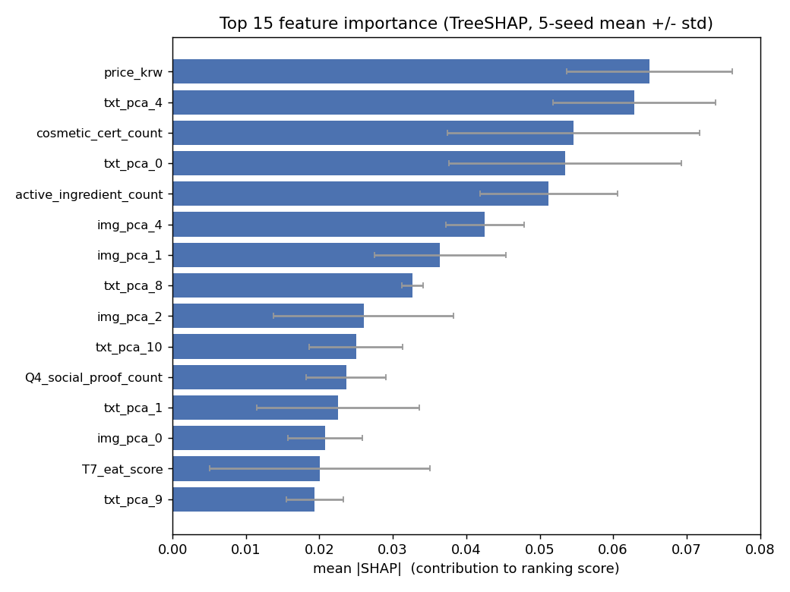
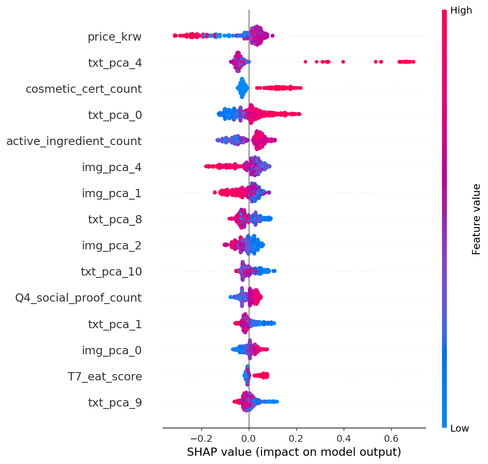
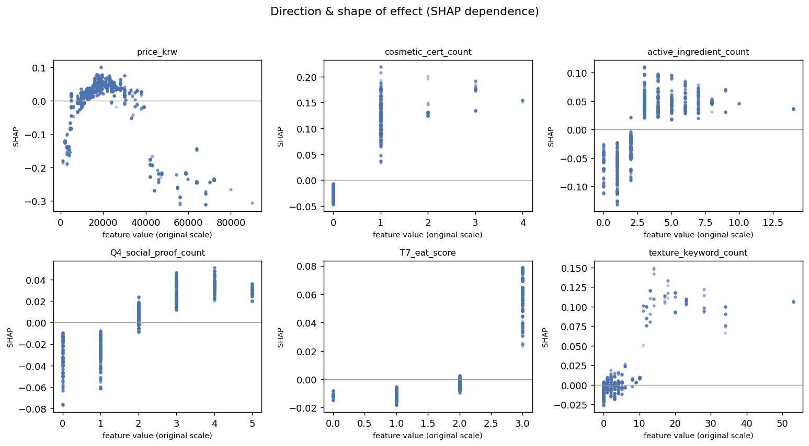
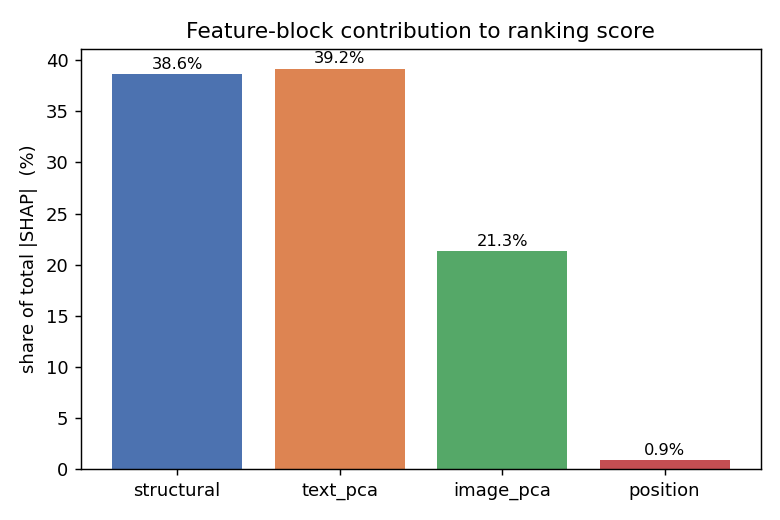
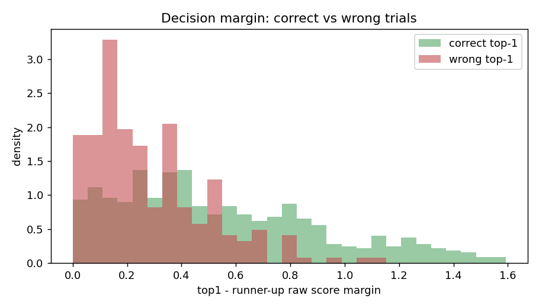

# 사후 분석 보고서: OpenAI 선호 랭커가 보는 변수

작성일: 2026-06-19
대상 모델: LightGBM lambdarank + semantic (OpenAI 엔진, step2 brand-holdout) — `TUNING_RESULTS.md`의 최고 성능 모델

생성 스크립트: `src/analysis/posthoc_lgbm.py`
수치 산출물: `artifacts/analysis/importance.json`, `pl_theta_corr.csv`
그림 산출물: 본 문서에 임베드

## 0. 분석 모델의 충실성 (재현 검증)

분석은 헤드라인 모델의 학습 경로(`src/lightgbm/lgbm_train.py`: train 분할에서 5-seed 앙상블, val로 early-stopping/온도보정, test 평가)를 그대로 복제한 뒤 그 위에서 수행했다. 재현된 test 지표는 보고서 표와 **소수점까지 동일**하다.

| 지표 | 재현값 | TUNING_RESULTS |
| --- | ---: | ---: |
| top1_accuracy | 0.7286 | 0.7286 |
| pairwise_accuracy | 0.7832 | 0.7832 |
| ndcg@3 | 0.9607 | 0.9607 |
| kendall_tau | 0.5664 | 0.5664 |
| nll | 1.4093 | 1.4093 |
| brier_score | 0.3972 | 0.3972 |

따라서 아래 해석은 보고된 모델 그 자체에 대한 것이다. 중요도는 5개 시드 부스터의 TreeSHAP를 평균했고, 시드 간 표준편차를 안정성 밴드로 함께 보고한다.

## 1. 핵심 요약 (먼저 결론)

- AI는 **인증 마크가 있고**, **활성 성분이 충분하고(3개 이상)**, **신뢰/권위 신호(T7_eat, 사회적 증거)가 강한** 페이지를 선호한다. 가격은 **중간 가격대를 선호하고 초저가·초고가를 모두 감점**하는 비단조 효과다(3절 참조).
- AI는 **장황하고 주장(claim) 위주의 마케팅성 텍스트**를 담은 페이지를 감점한다(텍스트 임베딩 축 `txt_pca_4`가 이 성격을 대표하며 방향은 음수).
- **콘텐츠 임베딩(텍스트 39.2% + 이미지 21.3% = 60.5%)이 점수 기여의 과반**을 차지한다. 구조 특징은 38.6%. 이는 임베딩 도입이 top1을 63%→70%로 끌어올린 결과를 정량적으로 뒷받침한다.
- **위치 편향은 거의 없다**: 제시 순서 특징은 45개 중 35위, 기여 0.9%. AI 라벨이 제시 순서에 크게 흔들리지 않았다는 뜻으로 라벨 품질 측면에서 긍정적이다.
- **결과의 견고성**: LightGBM과 XGBoost의 중요도 순위 상관이 Spearman 0.93(구조 특징만 0.89)으로 매우 높아, 특정 모델의 산물이 아니다. 모델과 독립인 Plackett-Luce 강도(`pl_theta`)와의 상관도 인증/신뢰/성분 신호에서 같은 방향으로 유의하다.

## 2. 전역 특징 중요도 (A)

상위 8개(평균 |SHAP|, 괄호는 평균 효과 방향):

| 순위 | 특징 | 평균 |SHAP| | 방향 | 블록 |
| ---: | --- | ---: | :--: | --- |
| 1 | `price_krw` | 0.065 | 하락 | 구조 |
| 2 | `txt_pca_4` | 0.063 | 하락 | 텍스트 |
| 3 | `cosmetic_cert_count` | 0.055 | 상승 | 구조 |
| 4 | `txt_pca_0` | 0.053 | 하락 | 텍스트 |
| 5 | `active_ingredient_count` | 0.051 | 상승 | 구조 |
| 6 | `img_pca_4` | 0.043 | 상승 | 이미지 |
| 7 | `img_pca_1` | 0.036 | 하락 | 이미지 |
| 8 | `txt_pca_8` | 0.033 | 하락 | 텍스트 |

gain/split 기반 순위도 거의 같다(`importance.json`의 `global_importance_gain`/`_split`). gain에서는 `txt_pca_4`가 1위, `price_krw`가 2위로 순서만 바뀐다. `Q9_external_authority_count`는 세 기준 모두에서 기여 0(트리가 한 번도 분기에 쓰지 않음)으로, 사실상 죽은 특징이다.

## 3. 효과의 방향과 형태 (B)

부호가 있는 평균 SHAP 기준으로 정리한 "AI가 선호/비선호하는 것":

- **선호(상승)**: `cosmetic_cert_count`(+0.0155), `T7_eat_score`(+0.0092), `active_ingredient_count`(+0.0067), `img_pca_4`(+0.0063), `Q4_social_proof_count`(+0.0029)
- **비선호(하락)**: `txt_pca_4`(-0.0167), `price_krw`(-0.0136), `img_pca_1`(-0.0092), `txt_pca_8`(-0.0052), `txt_pca_11`(-0.0039)

dependence plot에서 읽히는 형태(x축은 log1p/스케일링을 역변환한 원척도):

- `price_krw`: **비단조**. 약 1.5만~3.5만원 중간 가격대에서 SHAP이 가장 높고, 초저가(<5천원)와 초고가(>4만원)는 모두 음수로 강하게 떨어진다. "고가일수록 무조건 감점"이 아니라 **중간 가격대 선호 + 양극단 감점**이다. (8절의 pl_theta 불일치도 이 비선형성으로 설명된다.)
- `cosmetic_cert_count`: 0이면 음수, **1 이상이면 급격히 양수**로 점프하는 사실상 이진 신호(있다/없다).
- `active_ingredient_count`: 0~2개는 음수, **3개 이상에서 양수**로 전환 후 완만한 포화.
- `Q4_social_proof_count`: 0~4까지 단조 증가.
- `T7_eat_score`: 최고값(3)에서만 뚜렷한 양수로 점프.
- `texture_keyword_count`: 약 10개 이상에서 양수.

## 4. 블록별 기여도 (C)

| 블록 | 차원 수 | 총 |SHAP| 비중 |
| --- | ---: | ---: |
| 텍스트 임베딩(txt_pca) | 16 | 39.2% |
| 구조 특징 | 20 | 38.6% |
| 이미지 임베딩(img_pca) | 8 | 21.3% |
| 위치 | 1 | 0.9% |

콘텐츠 임베딩이 합계 60.5%로 점수의 주된 동력이다. 단 한 축당 기여로 보면 구조 특징의 상위 항목(`price_krw`, `cosmetic_cert_count`)이 개별 임베딩 축보다 크다. 즉 **"넓게 퍼진 콘텐츠 신호 + 소수의 강한 구조 신호"** 구조다.

## 5. 위치 편향 (D)

제시 순서(`position`) 특징의 기여는 평균 |SHAP| 0.0074로 **45개 중 35위, 전체의 0.9%**에 그친다. AI의 랭킹이 "먼저 보여준 항목"에 크게 좌우되지 않았고, 모델도 이 신호에 거의 의존하지 않는다. 라벨 수집 절차의 공정성 측면에서 안심할 수 있는 결과다.

## 6. 임베딩 축의 의미 부여 (E)

PCA 축 자체는 해석 불가하므로, 중요 축의 per-item 점수를 구조 특징과 상관시켜 성격을 추정했다.

- **`txt_pca_4`(텍스트 1위 축, 방향 하락)**: `skin_type_targets_count`(+0.45), `claim_keyword_count`(+0.42), `list_item_count`(+0.39), `paragraph_count`(+0.35), `explicit_number_count`(+0.33), `ambiguous_term_count`(+0.33)와 양의 상관. 즉 **주장 키워드가 많고 장황한 마케팅성 텍스트 축**으로 읽히며, AI는 이 축이 강한 페이지를 감점한다.
- **`img_pca_4`(이미지 1위 축, 방향 상승)**: `price_krw`(+0.27), `Q9_external_authority_count`(+0.20), `T7_eat_score`(+0.17), `jsonld_field_count`(+0.15)와 양의 상관. **권위/정형 데이터가 갖춰진(다소 고가의) 페이지의 이미지 스타일 축**으로 읽히며 AI가 선호한다.

> 주의: 이 상관 기반 라벨링은 정성적 추정이다. 정확한 의미 확정은 해당 축 극단의 실제 `page_text`/이미지를 직접 읽어야 한다(`trial_items.csv`).

## 7. 상호작용 (F)

상위 상호작용쌍(평균 |interaction|):

| 쌍 | 값 |
| --- | ---: |
| `active_ingredient_count` × `txt_pca_0` | 0.0141 |
| `cosmetic_cert_count` × `txt_pca_0` | 0.0080 |
| `text_length` × `txt_pca_0` | 0.0078 |
| `txt_pca_9` × `img_pca_4` | 0.0075 |
| `text_length` × `cosmetic_cert_count` | 0.0058 |

`txt_pca_0`이 여러 구조 신뢰 신호(성분 수, 인증 수, 텍스트량)와 반복적으로 상호작용한다. 즉 **텍스트 콘텐츠의 성격(`txt_pca_0` 축)이 구조적 신뢰 신호의 효과를 조절**하는 구조다. 같은 인증 수라도 콘텐츠 맥락에 따라 가점 폭이 달라진다.

## 8. 모델 독립 교차검증: pl_theta (G)

trial과 독립적으로 적합된 제품별 선호 강도 `pl_theta`(n=258)와 구조 특징의 Spearman 상관:

| 특징 | rho | p |
| --- | ---: | ---: |
| `cosmetic_cert_count` | +0.37 | 7e-10 |
| `T7_eat_score` | +0.28 | 5e-06 |
| `ambiguous_term_count` | +0.24 | 7e-05 |
| `texture_keyword_count` | +0.24 | 9e-05 |
| `numeric_specificity_ratio` | -0.24 | 1e-04 |
| `Q4_social_proof_count` | +0.21 | 7e-04 |
| `claim_keyword_count` | +0.21 | 8e-04 |
| `active_ingredient_count` | +0.16 | 0.01 |

인증/EAT/사회적 증거/성분 신호가 **모델과 무관하게도** AI 강도와 유의한 양의 상관을 보여, 1~3절의 모델 중요도가 데이터 자체의 신호임을 뒷받침한다.

**중요한 불일치 한 가지**: `price_krw`는 모델 |SHAP| 1위지만 `pl_theta` 상관 상위권에 없다(약함). 즉 가격의 단변량 선형 신호는 제품 수준에서 약하고, 모델은 가격을 주로 **비선형/상호작용 맥락**에서 사용하는 것으로 보인다. 가격 효과는 단정적으로 해석하지 말 것.

## 9. 모델 간 합의 (H)

LightGBM과 XGBoost(rank:ndcg)의 특징 중요도 순위 상관:

- 전체 45개: Spearman **0.93**
- 구조 20개만: Spearman **0.89**

두 알고리즘이 거의 같은 변수를 짚는다. 결론이 단일 모델의 우연한 산물이 아니라는 강한 근거다.

## 10. 오류 분석 (I)

818개 test trial 중 top1 정답률 72.9%. 1위-2위 raw 점수차(margin) 비교:

| | 정답 trial | 오답 trial |
| --- | ---: | ---: |
| 평균 margin | 0.56 | 0.28 |
| 중앙값 margin | 0.47 | 0.22 |

오답은 대부분 **점수차가 작은 박빙 trial**에 몰려 있다. 즉 모델이 계통적으로 엉뚱한 페이지를 1위로 올리는 게 아니라, 막상막하 후보들 사이에서 갈리는 경우에 틀린다. 이는 추가 성능 향상의 여지가 "쉬운 케이스 개선"보다 "박빙 케이스 변별력 강화"에 있음을 시사한다.

## 11. 일반화 격차 / 오버피팅 점검

"콘텐츠 임베딩이 점수 기여의 60.5%"라는 사실은 **모델이 임베딩에 얼마나 의존하는가**(기여도)이지 **오버피팅**(train↔미지 데이터 격차)이 아니다. 둘은 별개 개념이며, 이 비중 자체도 train이 아닌 미지 브랜드 test 예측 위에서 측정했다. 오버피팅 여부는 아래 두 직접 측정으로 확인한다(스크립트: `src/analysis/overfit_check.py`).

**[1] train ↔ 미지 브랜드 test 격차** (동일 5-seed 앙상블)

| 지표 | train | test | gap |
| --- | ---: | ---: | ---: |
| top1 | 0.8715 | 0.7286 | 0.143 |
| pairwise | 0.8950 | 0.7832 | 0.112 |
| ndcg@3 | 0.9834 | 0.9607 | 0.023 |
| kendall_tau | 0.7900 | 0.5664 | 0.224 |

격차는 0이 아니다. 고유 제품 약 258개 규모에서 자연스러운 수준의 약한 오버피팅은 존재한다. 핵심 질문은 "이 격차가 임베딩 때문인가"이며, 그에 대한 답이 [2]다.

**[2] 임베딩 ablation — 동일한 미지 브랜드 test에서**

| 지표 | 구조만 | +임베딩 | Δ |
| --- | ---: | ---: | ---: |
| top1 | 0.6846 | 0.7286 | +0.044 |
| pairwise | 0.7673 | 0.7832 | +0.016 |
| kendall_tau | 0.5346 | 0.5664 | +0.032 |

임베딩이 단순 암기였다면 **처음 보는 브랜드**에서는 도움이 안 되거나 해를 끼쳐야 한다. 그런데 미지 브랜드 top1을 +4.4%p 끌어올린다. 즉 임베딩은 일반화되는 진짜 신호이며, 격차의 원인이 아니라 오히려 test 성능을 높인다.

**오버피팅을 막은 장치(파이프라인 내장)**: (1) PCA 1024→16, 512→8 차원 축소, (2) PCA를 train fold에서만 fit(누출 차단), (3) 16/8 차원을 brand-CV로 선택, (4) 트리 정규화(`min_child_samples=50, reg_lambda=0.5, feature_fraction=0.7, bagging_fraction=0.8`), (5) 브랜드 단위 holdout 평가. 보고된 0.7286은 이미 미지 브랜드 점수다.

격차를 더 줄이려면 PCA 차원 추가 축소·트리 정규화 강화·데이터 증량이 레버지만, 현재 설정은 held-out 기준 net-positive라 무리해서 줄일 이유는 없다.

## 12. 한계와 주의 (직접 명시)

- **연관 ≠ 인과**: SHAP 중요도는 모델이 의존하는 신호일 뿐, AI의 실제 추론 근거와 다를 수 있다.
- **PCA 축 비해석성**: 임베딩 축의 의미는 6절의 상관 기반 추정에 한정한다. 정량 결론은 구조 특징 20개 기준으로 받아들일 것.
- **표본 규모**: 고유 제품 약 258개. 시드 간 std가 큰 특징(예: `cosmetic_cert_count`, `T7_eat_score`)은 결론을 약하게 다뤘다. 그림의 오차막대를 함께 볼 것.
- **가격 신호의 모호성**: 8절의 불일치 때문에 "AI는 싼 걸 선호한다"는 단정은 피한다.

## 13. 시사점 (성능 개선과의 연결)

- `Q9_external_authority_count`는 완전히 죽은 특징, `numeric_specificity_ratio`/`jsonld_field_count`/`ambiguous_term_count`도 모델 기여가 미미하다. 특징 정리(pruning) 또는 재설계 후보다.
- 오류가 박빙 trial에 집중되므로, 변별력 향상(예: 보정 개선, 콘텐츠 임베딩 차원/지도 축소)이 무차별 모델 추가보다 효과적일 가능성이 높다.
- 텍스트 임베딩이 단일 최대 블록이므로, 임베딩 표현 개선의 한계이득이 구조 특징 추가보다 클 것으로 기대된다.

## 14. 비즈니스 함의 / 운영 방안 (쿼리·페르소나 조건부 모델)

> 범위 주의: 본 섹션은 위 OpenAI 고정쿼리 모델 분석에 국한되지 않는다. **쿼리 고정 실험(원본
> `response.csv`)** 과 **쿼리 변형 실험(`anthropic_various_query_type.csv`, protocol `step2qt`)**
> 을 종합한 전략적 결론이다. 상세 수치는 `artifacts/results_step2qt/RESULTS.md`,
> `artifacts/tuning_anthropic/TUNING_RESULTS_anthropic.md` 참조.

### 14.1 두 실험 종합 — 쿼리 프레이밍은 추천을 바꾼다

같은 "아이템 피처만" 모델인데 쿼리 환경에 따라 설명력이 갈린다.

| 조건 | 입력 | test top1 |
| --- | --- | ---: |
| 쿼리 **고정** (원본, 제품 295) | 아이템 피처만 | ~0.68 |
| 쿼리 **변형** (step2qt, 제품 45) | 아이템 피처만 (쿼리 숨김) | ~0.56 |
| 쿼리 **변형** (step2qt) | 아이템 암기 베이스라인(인기순) | 0.59 |
| 쿼리 **변형** (step2qt) | **+ query_type/persona (쿼리 공개)** | **0.69** |

핵심은 step2qt 내부의 통제된 비교다. 쿼리를 숨기면 "인기 제품 찍기(0.59)"조차 못 넘지만(0.56),
쿼리 문맥을 입력에 넣으면 0.69로 +10%p 회복된다. 다른 변수는 고정이므로 이 상승분은 **전적으로
쿼리 프레이밍 효과**다. 데이터상 신호 크기는 **persona > query_type** 순이었다(타겟 소비자층이
제품 카테고리 프레이밍보다 추천을 더 강하게 가른다).

> 단, 이 모델이 예측하는 것은 인간 선호가 아니라 **LLM(추천 엔진)의 행동**이다. 산출물은
> "AI 어시스턴트가 우리 타겟 고객의 질문에 우리 제품을 몇 위로 올릴 것인가"의 예측이다.

### 14.2 일반화 한계를 "운영 범위 결정"으로 재해석

제품 풀이 작다(45종, 홀드아웃 4브랜드)는 한계는 **임의의 신제품 일반화**에만 해당한다. 회사가
타겟 소비자층(페르소나)과 질문 유형이 뚜렷하고 카탈로그가 고정적이라면, 그 운영 포인트에서는
오히려 강점이 된다.

- **조건부 예측이 곧 세그먼트 readout**: persona/query가 입력이라 "PRIMARY 페르소나 × 가격(PRC)
  질문" 같은 특정 슬라이스 예측을 바로 뽑는다. 전 구간 일반화가 필요 없다.
- **고정 카탈로그면 작은 풀이 무해**: 제품당 관측이 많아(45종 × 3,000 trial) 쿼리 조건부 효과
  학습이 잘 된다.
- **타겟이 뚜렷할수록 효용 증가**: 신호가 가장 강한 persona 축으로 조건을 걸수록 예측력과
  실행 인사이트가 모두 선명해진다.

### 14.3 경계 조건 (정직하게)

- **제품축은 안 풀린다**: 세그먼트 프레이밍은 persona/query 축만 고정한다. 카탈로그가 바뀌어
  새 SKU를 점수화하려면 제품 풀을 키워야 한다. "고정/알려진 제품군"일 때만 신뢰.
- **학습 격자 밖은 외삽 불가**: 5개 query_type × 4개 persona 밖의 프레이밍은 추정 안 된다.
  → 회사 타겟이 격자 밖이면 그 프레이밍으로 **데이터를 새로 수집**해야 한다.
- **천장 미측정**: 0.69가 LLM self-consistency 한계 대비 어디인지 모른다(동일 프롬프트 반복
  샘플 부재). 모델 단일(haiku)이라 강한 모델일수록 결정론적일 여지.

### 14.4 실행 가능한 산출물 (GEO 레버)

비즈니스 가치는 top1=0.69라는 숫자가 아니라, **타겟 세그먼트에서 LLM 추천 순위를 끌어올리는
페이지 피처 레버**다. 본 문서 2~3절의 방향성 결과(인증 마크·활성 성분 3개↑·EAT/사회적 증거는
가점, 장황한 주장형 텍스트·가격 양극단은 감점)가 그 출발점이고, query_type과의 상호작용을 함께
보면 "이 질문 유형에서 무엇을 바꿔야 1위가 되는가"가 나온다.

### 14.5 운영 레시피

1. 회사의 **타겟 페르소나 × 질문 프레이밍**을 특정한다.
2. 그 프레이밍으로 후보 제품군에 대한 **LLM 랭킹 데이터를 수집**한다(haiku 등 대상 엔진).
3. `src/prep_query_type.py` → `DM_DATASET=query_type` 파이프라인을 그대로 돌려 **조건부 모델**을
   학습한다.
4. 세그먼트 슬라이스 예측 + 피처 중요도로 **콘텐츠 최적화(GEO) 우선순위**를 도출한다.

요약: "범용 추천 예측기"가 아니라 **타겟 세그먼트별 조건부 모델**이 올바른 제품 형태다. 타겟이
뚜렷할수록(고정 페르소나·쿼리·카탈로그) 예측력과 실행 인사이트가 함께 커진다.

---

재현/재실행: `python src/analysis/posthoc_lgbm.py` (artifacts/analysis/ 갱신)
