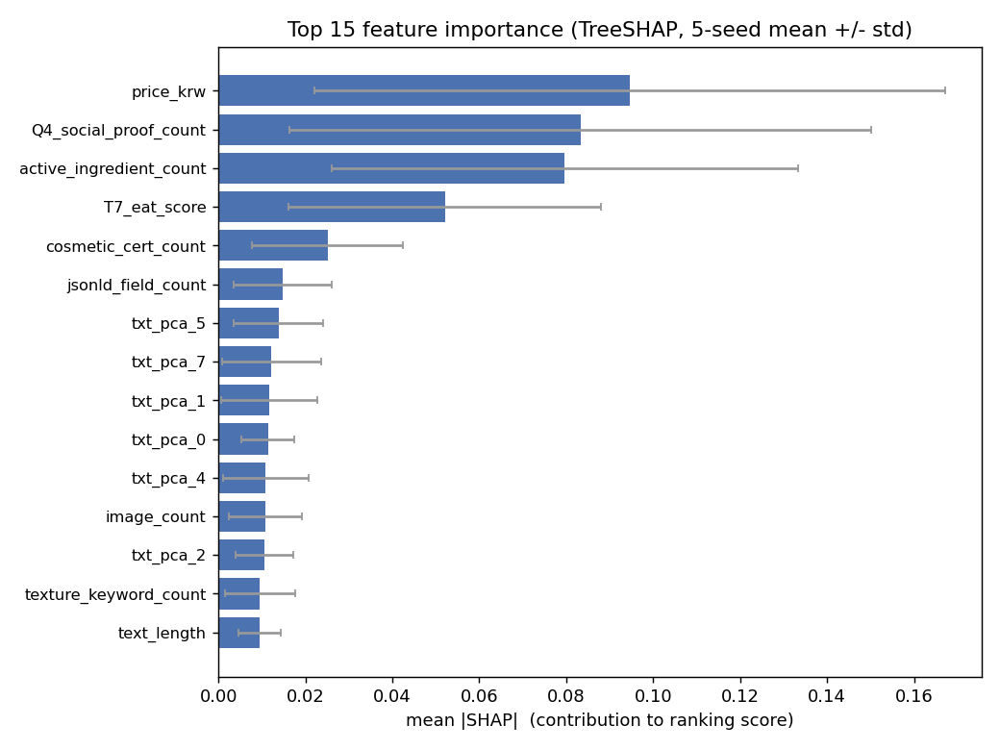
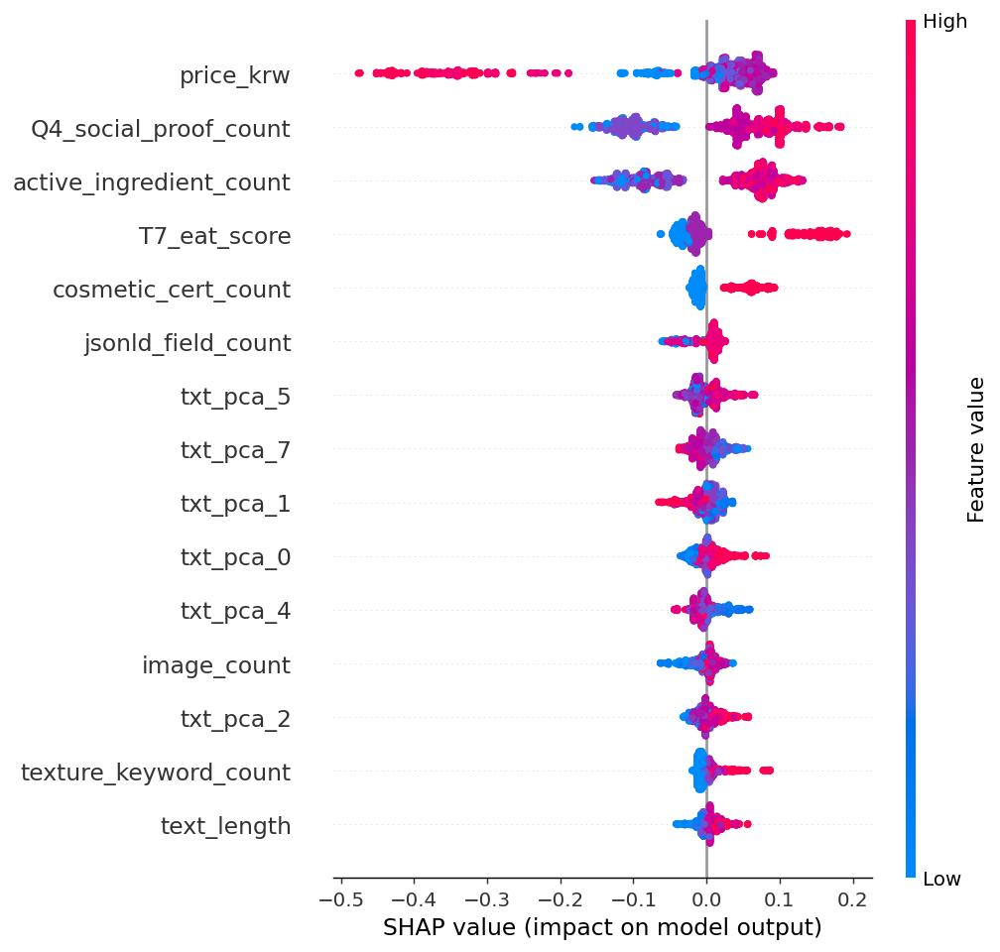
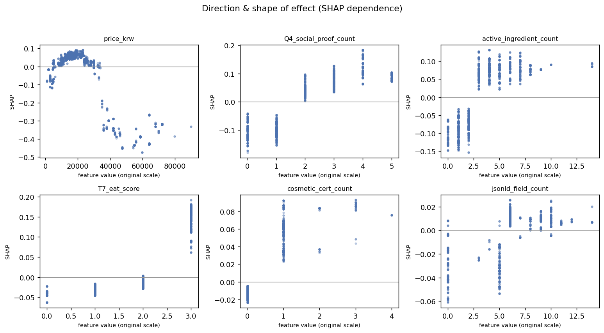
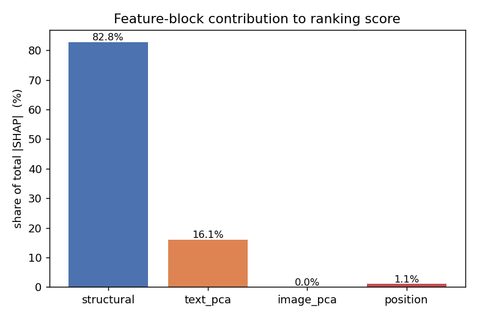
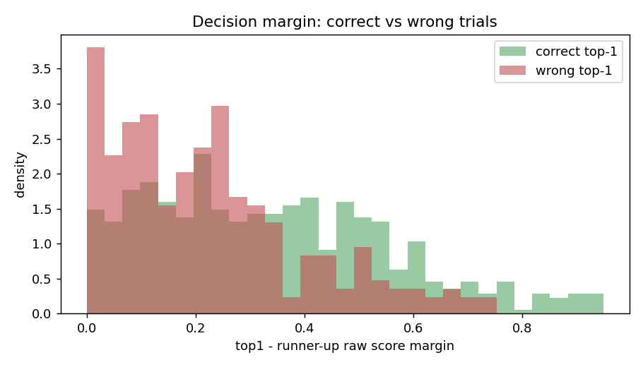

# 사후 분석 보고서: Anthropic 선호 랭커가 보는 변수

작성일: 2026-06-19
대상 모델: LightGBM lambdarank + semantic (Anthropic 엔진, step2 brand-holdout) — `TUNING_RESULTS_anthropic.md`의 top1 최고 모델(`lgbm`)
생성: `python src/analysis/posthoc_lgbm.py --engine anthropic`
산출물: `artifacts/analysis_anthropic/{importance.json, pl_theta_corr.csv, *.png}`

> OpenAI 동일 분석은 [../analysis/ANALYSIS_RESULTS.md](../analysis/ANALYSIS_RESULTS.md). 본 문서는 같은 파이프라인을 `engine=anthropic`로 실행했고, 마지막 13절에 두 엔진을 직접 비교한다.

## 0. 재현 검증

헤드라인 학습 경로를 복제해 test 지표가 `TUNING_RESULTS_anthropic.md`와 소수점까지 일치한다.

| 지표 | 재현값 | 보고서 |
| --- | ---: | ---: |
| top1_accuracy | 0.6787 | 0.6787 |
| pairwise_accuracy | 0.7812 | 0.7812 |
| ndcg@3 | 0.9575 | 0.9575 |
| kendall_tau | 0.5625 | 0.5625 |
| nll | 1.3412 | 1.3412 |
| brier_score | 0.4496 | 0.4496 |

Anthropic의 선택 시맨틱 설정은 `text_pca_dim=8, image_pca_dim=0`(eff_dim=29)으로, **이미지 임베딩 블록이 아예 없다**(OpenAI는 16/8, eff_dim=45). 중요도는 5-seed TreeSHAP 평균, 시드 간 std를 안정성 밴드로 보고.

## 1. 핵심 요약 (먼저 결론)

- Anthropic은 **사회적 증거(Q4)**, **활성 성분(3개 이상)**, **신뢰/권위(T7_eat 최고값)**, **인증 마크(있음)**가 강한 페이지를 선호한다. 가격은 OpenAI와 동일하게 **중간 가격대 선호 + 양극단 감점**의 비단조 효과.
- **구조 특징이 점수 기여의 82.8%**를 차지한다(텍스트 임베딩 16.1%, 이미지 0%, 위치 1.1%). 즉 Anthropic의 선호는 **명시적 구조 신호로 거의 다 설명**되며, OpenAI보다 훨씬 해석 가능하다.
- **위치 편향 거의 없음**: 위치 특징 29개 중 21위, 기여 1.1%.
- **견고성 최상**: LightGBM vs XGBoost 중요도 순위 상관 Spearman 0.97(구조만 0.955). 모델과 독립인 `pl_theta`와의 상관도 사회적 증거 0.48, 성분 0.43, EAT 0.36 등 매우 강한 양의 유의로, 1절 결론을 강하게 뒷받침한다.

## 2. 전역 특징 중요도 (A)

상위 8개(평균 |SHAP|, 괄호는 평균 효과 방향):

| 순위 | 특징 | 평균 |SHAP| | 방향 | 블록 |
| ---: | --- | ---: | :--: | --- |
| 1 | `price_krw` | 0.094 | 하락 | 구조 |
| 2 | `Q4_social_proof_count` | 0.083 | 상승 | 구조 |
| 3 | `active_ingredient_count` | 0.080 | 상승 | 구조 |
| 4 | `T7_eat_score` | 0.052 | 상승 | 구조 |
| 5 | `cosmetic_cert_count` | 0.025 | 상승 | 구조 |
| 6 | `jsonld_field_count` | 0.015 | 상승 | 구조 |
| 7 | `txt_pca_5` | 0.014 | 하락 | 텍스트 |
| 8 | `txt_pca_7` | 0.012 | 상승 | 텍스트 |

상위 6개가 모두 구조 특징이다. 첫 임베딩 축(`txt_pca_5`)은 7위로 처음 등장하며 기여도 상위 구조 특징의 1/6 수준이다.

## 3. 효과의 방향과 형태 (B)

- `price_krw`: **비단조**. 약 1.5만~3만원에서 최고, 초저가와 4만원 이상은 음수로 강하게 하락. OpenAI와 동일한 형태.
- `Q4_social_proof_count`: 0~1은 음수, **2 이상 양수**로 전환 후 포화.
- `active_ingredient_count`: 0~2 음수, **3 이상 양수** 포화.
- `T7_eat_score`: 최고값(3)에서만 뚜렷한 양수로 점프(0~2는 음수).
- `cosmetic_cert_count`: 0 음수, **1 이상 양수**(이진 신호).
- `jsonld_field_count`: 약 6개 이상에서 양수.

부호 있는 평균 SHAP 최강: `price_krw`(-0.027), `T7_eat_score`(+0.018), `active_ingredient_count`(+0.011), `Q4_social_proof_count`(+0.008), `cosmetic_cert_count`(+0.007).

## 4. 블록별 기여도 (C)

| 블록 | 차원 수 | 총 |SHAP| 비중 |
| --- | ---: | ---: |
| 구조 특징 | 20 | 82.8% |
| 텍스트 임베딩(txt_pca) | 8 | 16.1% |
| 이미지 임베딩 | 0 | 0.0% |
| 위치 | 1 | 1.1% |

**가장 큰 특징**: Anthropic은 구조 특징에 압도적으로(82.8%) 의존한다. 튜닝에서 이미지 PCA가 선택조차 되지 않았고, 텍스트 임베딩 기여도 16%에 그친다. 이는 콘텐츠 임베딩이 60.5%를 차지한 OpenAI와 정반대 구조다(13절 비교).

## 5. 위치 편향 (D)

위치 특징 기여는 평균 |SHAP| 0.0055로 **29개 중 21위, 전체의 1.1%**. AI 라벨이 제시 순서에 거의 흔들리지 않았다.

## 6. 임베딩 축의 의미 부여 (E)

텍스트 임베딩 기여가 작아 해석 가치는 제한적이다. 최상위 축 `txt_pca_5`(방향 하락)는 `explicit_number_count`(-0.23), `list_item_count`(-0.16), `Q9_external_authority_count`(-0.14), `claim_keyword_count`(-0.13)와 음의 상관 → 대략 **숫자/목록/외부권위 나열이 적은 축**으로, 이 축이 높을수록(=나열이 적을수록) 약하게 감점. 이미지 축은 존재하지 않는다.

## 7. 상호작용 (F)

| 쌍 | 값 |
| --- | ---: |
| `active_ingredient_count` × `Q4_social_proof_count` | 0.0064 |
| `price_krw` × `T7_eat_score` | 0.0062 |
| `active_ingredient_count` × `txt_pca_5` | 0.0052 |
| `table_count` × `price_krw` | 0.0045 |
| `active_ingredient_count` × `T7_eat_score` | 0.0040 |

상위 상호작용이 모두 구조 신뢰 신호 사이에서 발생한다(성분×사회적증거, 가격×EAT). OpenAI에서 `txt_pca_0`이 중심 허브였던 것과 달리, Anthropic은 **명시적 구조 신호 간 상호작용**이 지배한다.

## 8. 모델 독립 교차검증: pl_theta (G)

`pl_labels_step2_anthropic.csv`(n=258)와 구조 특징의 Spearman 상관:

| 특징 | rho | p |
| --- | ---: | ---: |
| `Q4_social_proof_count` | +0.48 | 3e-16 |
| `active_ingredient_count` | +0.43 | 4e-13 |
| `T7_eat_score` | +0.36 | 2e-09 |
| `skin_type_targets_count` | +0.34 | 3e-08 |
| `claim_keyword_count` | +0.32 | 1e-07 |
| `image_count` | +0.31 | 4e-07 |
| `cosmetic_cert_count` | +0.30 | 1e-06 |
| `text_length` | +0.28 | 6e-06 |

모델 중요도 상위 신호(사회적 증거·성분·EAT·인증)가 **모델과 무관하게도** 강한 양의 상관을 보인다. OpenAI(최강 cosmetic_cert 0.37)보다 상관이 전반적으로 더 강해, Anthropic 선호가 구조 신호로 더 깔끔하게 설명됨을 재확인한다.

## 9. 모델 간 합의 (H)

- 전체 29개: Spearman **0.97**
- 구조 20개만: Spearman **0.955**

OpenAI(0.93/0.89)보다도 높아, Anthropic의 중요도 결론은 알고리즘에 거의 무관하게 안정적이다.

## 10. 오류 분석 (I)

800개 test trial, top1 정답률 67.9%. 1위-2위 raw 점수차:

| | 정답 trial | 오답 trial |
| --- | ---: | ---: |
| 평균 margin | 0.35 | 0.22 |
| 중앙값 margin | 0.32 | 0.20 |

OpenAI와 동일하게 **오답은 박빙 trial에 집중**된다. 계통적 오류가 아니라 막상막하 케이스에서 갈린다.

## 11. 한계와 주의

- **연관 ≠ 인과**: SHAP 중요도는 모델이 의존하는 신호일 뿐 AI의 실제 추론 근거와 다를 수 있다.
- **표본 규모**: 고유 제품 약 258개. 시드 간 std 큰 특징은 결론을 약하게 다룰 것(그림 오차막대 참조).
- **가격 신호의 비선형성**: 3절의 비단조 형태 때문에 "싼 걸 선호"라는 단정은 피한다.
- **엔진 간 절대 지표 비교 주의**: OpenAI/Anthropic은 test 아이템·trial 수가 달라(818 vs 800) top1 절대값 직접 비교는 신중히. 본 보고서의 핵심은 "무엇을 보는가"의 구조 차이다.

## 12. 시사점

- Anthropic은 구조 특징만으로 거의 설명되므로, **구조 특징 품질 개선**(예: 사회적 증거·성분·인증 추출 정확도)의 한계이득이 임베딩 개선보다 클 것으로 기대된다.
- 이미지 임베딩이 0으로 선택된 만큼 Anthropic 파이프라인에서 이미지 임베딩 계산은 생략 가능(비용 절감).
- OpenAI와 마찬가지로 오류가 박빙 trial에 몰려 있어, 변별력 강화가 개선 포인트다.

## 13. 엔진 비교: OpenAI vs Anthropic

| 항목 | OpenAI | Anthropic |
| --- | ---: | ---: |
| 재현 top1 (test) | 0.7286 | 0.6787 |
| 구조 특징 비중 | 38.6% | **82.8%** |
| 텍스트 임베딩 비중 | 39.2% | 16.1% |
| 이미지 임베딩 비중 | 21.3% | **0.0%**(미선택) |
| 위치 편향 비중 | 0.9% | 1.1% |
| 최상위 특징 | `price_krw`(↓) | `price_krw`(↓) |
| 2위 특징 | `txt_pca_4`(↓, 임베딩) | `Q4_social_proof`(↑, 구조) |
| lgbm-xgb 합의(구조) | 0.89 | 0.955 |
| pl_theta 최강 상관 | cosmetic_cert +0.37 | Q4_social_proof +0.48 |

**공통점**: 두 AI 모두 (1) 가격 양극단을 감점하고 중간 가격대를 선호하는 동일한 비단조 형태, (2) 인증·활성 성분·EAT·사회적 증거 같은 신뢰/콘텐츠 신호를 선호, (3) 위치 편향이 거의 없고, (4) 오답이 박빙 trial에 집중. "좋은 페이지"의 정의가 상당 부분 겹친다.

**핵심 차이**: **무엇으로 그 판단을 표현하는가**가 다르다. OpenAI는 불투명한 콘텐츠 임베딩(텍스트+이미지 60.5%)에 크게 의존하는 반면, **Anthropic은 명시적 구조 신호(82.8%)로 거의 다 설명**되고 이미지 임베딩은 쓰지 않는다. 결과적으로 Anthropic의 선호가 더 해석 가능하고, 중요도의 견고성(모델 간 합의·pl_theta 상관)도 더 높다.
